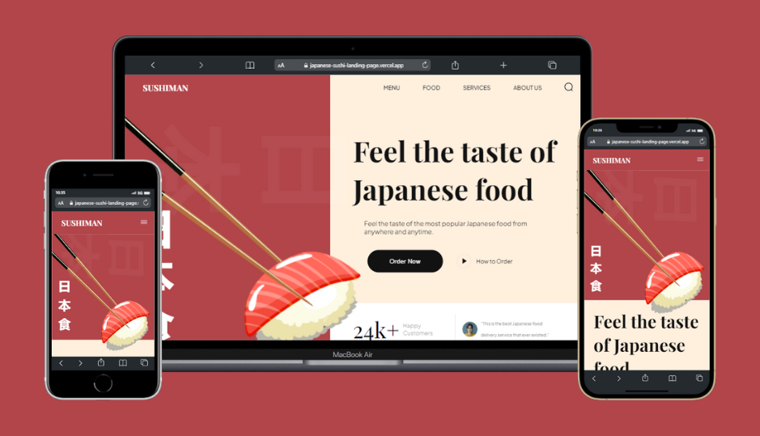
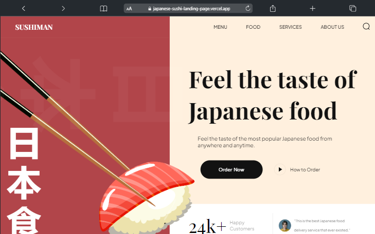
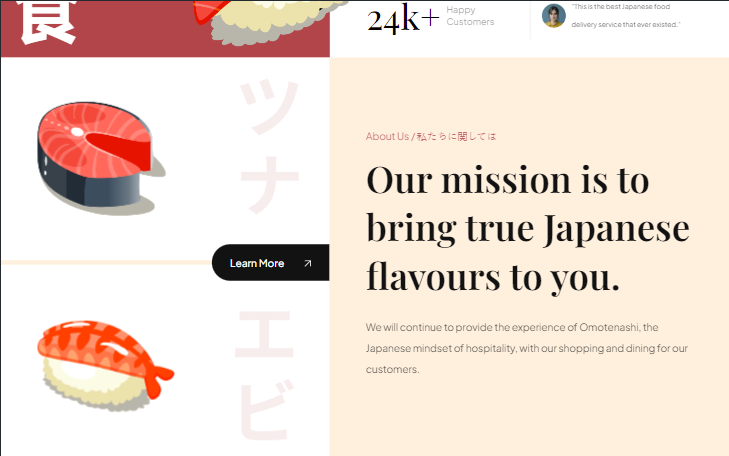
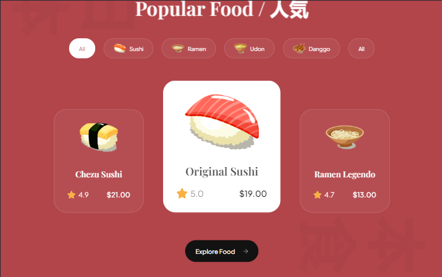
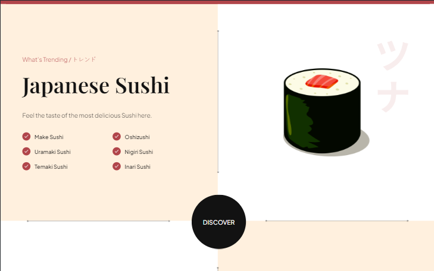
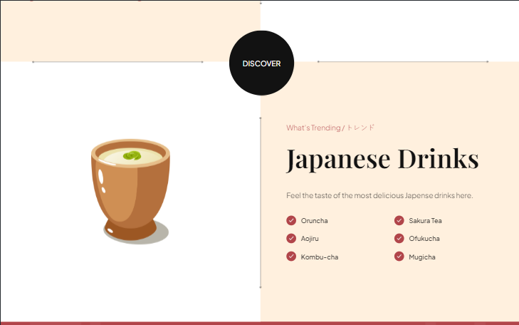
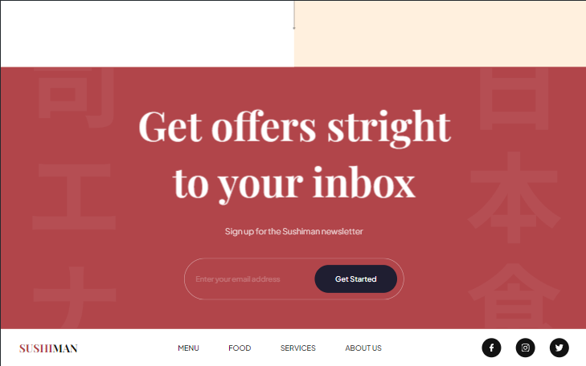

# Sushiman 🍣

## Overview

Welcome to Landing Page **Sushiman: Feel the taste of Japanese food!**

###

It is an irresistible invitation to explore the delicious flavors of Japanese cuisine. An image of an artistic dish, full of colorful sushi and fresh sashimi, dominates the center of the page. The slogan "feels the taste of Japanese food" is highlighted above, evoking a feeling of authenticity and passion for oriental cuisine.

###

Visitors are invited to board a single gastronomic journey. A gallery of interactive images displays a variety of Japanese dishes, from the traditional Nigiris to the innovative creations of our chef.

###

Landing Page Sushiman is designed to involve visitors on a visual and sensory journey by Japanese cuisine. With tempting images, clear service information and a touch of authenticity.

You can access the site on this [link](https://japanese-sushi-landing-page.vercel.app).

## Stack used:

**Project Manager:** ClickUp;

**Front-end:** HTML5, CSS3, JavaScript;

**Libraries:** <a href="https://michalsnik.github.io/aos/">AOS(Animate On Scroll)</a>.

### Tools:

IDE: VSCode;

APP Host: Vercel;

## Repo made by:

Diogo Silva ([@w4xdgsilva](https://github.com/w4xdgsilva))

## Learnings

In developing the "Sushiman" project, I was able to improve my CSS skills and learn how to use the animation library to. I faced challenges by synchronizing animations with the user's scroll and creating a responsive image gallery that kept a quick performance. In addition, making the responsive landing page on different devices was an additional challenge that required me to explore flexible layout techniques and adapt visual elements. In the end, this experience not only resulted in a visually attractive landing page, but also boosted my growth as a developer.

## Credits

[Adrian Hajdin - JS Mastery](https://github.com/adrianhajdin)
